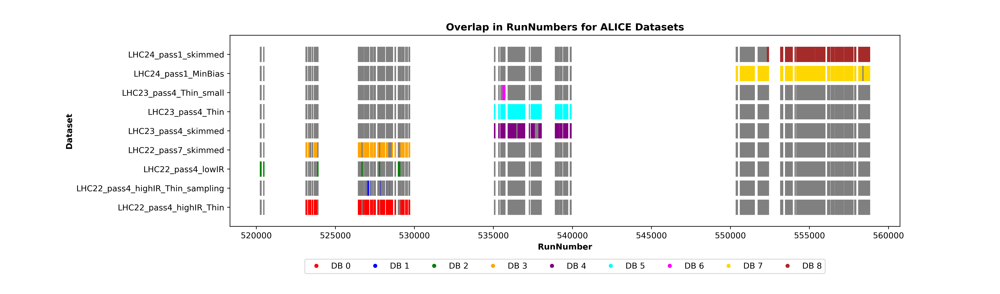

# Analyses of CERN-ALICE proton-proton collisions

The projects in this repository focus on IVM (invariant mass) distributions of proton-proton collisions, registered by [CERNs ALICE detector](https://home.cern/science/experiments/alice).

## Project summaries

### K0 DCA-filter project
The IVM distributions of the given dataset have a large peak at the mass of K0.  
With varying settings for a DCA-cutoff, a filter is built to remove K0 events from the set.  
[Read more..](projects/dcafilter/README.md)  
  


### IVM combinatorial background project
The IVM distributions also contain a so-called "combinatorial background", resulting from wrongly interpreted events which should not appear in the histograms.  
An estimate of that background is simulated in this project.  
[Read more..](projects/ivm_combinatorial_background/README.md)  


### runoverlap project
The .root files in a set of different datasets are analysed for the CERN-runs they contain.  
An overview over the runs and their overlap in the different datasets is built.  
[Read more..](projects/runoverlap/README.md)  
  

## Dependencies

Mandatory:
- **ROOT** 6.34.10 (installed via conda-forge)
- **rapidjson** ≥ 1.1

Optional (only for plotting / additional analysis):
- **Python** 3.13.5 with
  - numpy ≥ 1.26
  - matplotlib ≥ 3.8

## Installation
### Linux
It is crucial that the root framework from CERN is installed.  
In the following we will focus on the installation with conda, which is relatively easy.  
Details on root and other installation methods can be found here: https://root.cern/install/  

```bash
#1. clone repository:
git clone https://github.com/BastianGuggenberger/CERN_ALICE_Analyses

#2. navigate to project directory
cd CERN_ALICE_Analyses/projects/ivm_combinatorial_background

#3. install dependencies
conda config --set channel_priority strict
conda create -c conda-forge --name myenvironment root
conda activate myenvironment
conda install -c conda-forge rapidjson
conda install -c conda-forge numpy matplotlib
```

After installation, navigate to "CERN_ALICE_Analyses/projects/resources/ppPaths.h" and set the right paths to the json and rootfiles files.  

Also the following files and scripts should be stored as shown (if the installation is done as described in the next section, this will by default be the case):  
- ppHelpers.h: "CERN_ALICE_Analyses/projects/resources/ppHelpers/ppHelpers.h"  
- ppBranchAssignment.h: "CERN_ALICE_Analyses/projects/resources/ppHelpers/ppBranchAssignment.h"  
- ppDataItems.h: "CERN_ALICE_Analyses/projects/resources/ppHelpers/ppDataitems.h"  
- ppDataitems.C: "CERN_ALICE_Analyses/projects/resources/ppHelpers/ppDataItems.C"  
- ppConfig.json: "CERN_ALICE_Analyses/projects/resources/ppHelpers/ppConfig.json"  
- ppPaths.h: "CERN_ALICE_Analyses/projects/resources/ppPaths.h"  
- rootfiles.txt: "CERN_ALICE_Analyses/projects/resources/rootfiles.txt"  


## Support
email: bastian.guggenberger@aon.at

## License
This project is licensed under the MIT License – see the [LICENSE](LICENSE.txt) file for details.