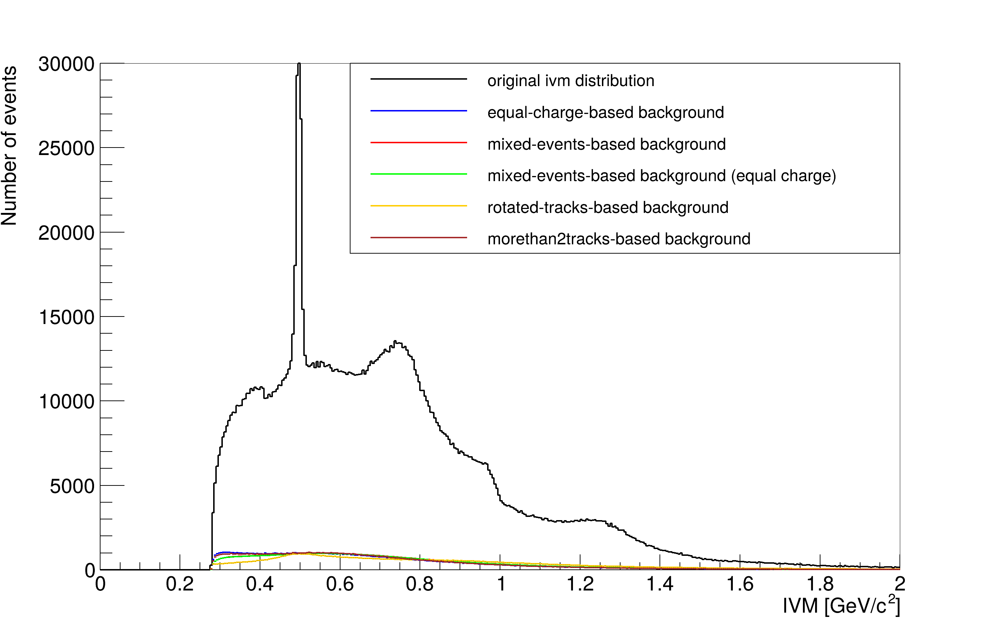

# IVM Combinatorial Background
The IVM(invariant masses) histograms from pp (proton-proton) collisions registered at CERNs ALICE-detector contain a so-called "combinatorial background", resulting from wrongly interpreted events which should not appear in the histogram.  

In this project, we analyze an IVM histogram where only pp Events with two resulting tracks are considered.  
There are two main types of events that appear in the combinatorial background:  
- two uncorrelated tracks can be interpreted as correlated tracks by the detecting system.  
An IVM is then calculated based on that assumption.
- two correlated tracks resulting from an event with 3 or 4 tracks can be wrongly interpreted as a two-track event.  
A false IVM is then calculated from the two tracks.  

This project aims at providing an idea of the shape of the combinatorial background, by using several methods, further described in the section "Project Structure".  

# Usage
```bash
#1. quickstart
cd background_comparison
chmod +x scaling.sh
./scaling.sh

#2. execute scripts separately:

#C++ scripts have to be compiled and run in the ROOT interpreter Cling:
cd equalsign
root            #start Cling
root [0] .L equalsign.C
root [1] equalsign()
root [2] .q     #quit Cling

#python code can be run normally outside of Cling

```
    

# Project Structure

There are four different methods used to reconstruct a combinatorial background.  
For each of theses methods, there is a seperate folder with the name "methodname", containing the file "methodname/methodname.C", where the main function "methodname()" builds the combinatorial background ivm histogram and saves it in "methodname/results/histograms/histo_methodname.root".  

**Used methods:**  

| Method            | Idea                                                                                  | Targeted Background Contribution      | Output File                 |
|-------------------|----------------------------------------------------------------------------------------|---------------------------------------|-----------------------------|
| **equalsign**     | Tracks with the same charge sign are combined as if they originated from the same event. Since such pairs never come from the same event, the histogram is a good indicator of the mixed-event background. | Mixed-event background | `equalsign/results/histo_equalsign.root` |
| **mixedevents**   | Track pairs from *different* events are combined as if they were from the same event.  | Mixed-event background | `mixedevents/results/histo_mixedevents.root` |
| **rotatedtracks** | The relative angle between two tracks from the same event is randomly changed, simulating artificial pairings. | Mixed-event background | `rotatedtracks/results/histo_rotatedtracks.root` |
| **morethan2tracks** | From events with 3 or 4 tracks, only 2 are selected to compute an IVM. Simulates the misinterpretation of multi-track events as two-track events. | Multi-track contamination | `morethan2tracks/results/histo_morethan2tracks.root` |


## Results  
The resulting histograms of the 4 different methods are scaled and plotted by the script "background_comparison/backgroundcomparison.C", containing two main functions:  

- plotsingle(name_method, dim_2=false):  
plots a single histogram from the rootfile "name_method/results/histograms/histo_name_method.root"  

- backgroundcomparison(double comparison_minimum,double comparison_maximum):  
plots logarithmic and linear scaled histograms of the 4 combinatorial backgrounds and the original ivm distribution.  
the scaling process fits the integrals of the 4 combinatorial backgrounds and keeps the background histograms under the original curve in the interval [comparison_minimum,comparison_maximum]  

The backgroundcomparison(double comparison_minimum,double comparison_maximum) function is iteratively called for different comparison intervals in the script "scaling.sh".


### Example Output: Scaled Background Comparison  



## License
This project is licensed under the MIT License – see the [LICENSE](../LICENSE.txt) file for details.